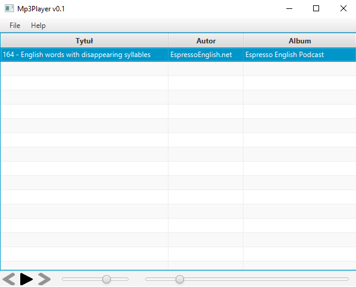
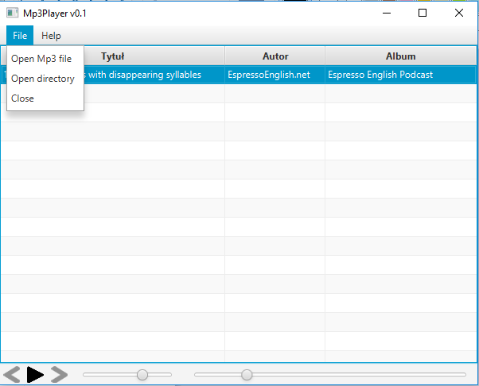

# Mp3Player
> Simple Mp3 player created with Java SE 9, JavaFX.

## Table of contents
* [General info](#general-info)
* [Screenshots](#screenshots)
* [Technologies](#technologies)
* [Status](#status)

## General info
Application was created to improve knowledge through the training.

## Screenshots

## Technologies
* JavaSE - version 9.0.4
* JavaFX - version 9.0.4
* jid3lib - version 0.5.4

## Status
Project is: _finished_
